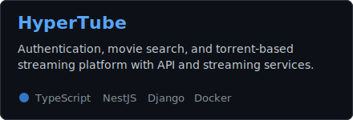
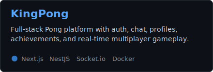
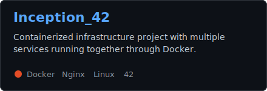
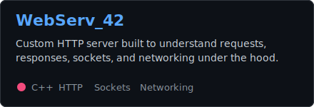
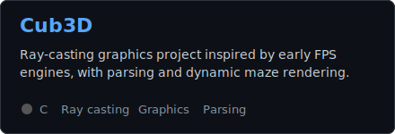
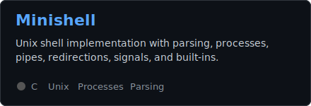

<h1 align="center">Hi, I'm Aymane Aggoujjil</h1>

  <strong>Software Engineer</strong> building full-stack products, real-time systems, and backend services.

  
  

---

## About me

I'm a Software Engineer focused on practical, well-structured applications from UI to infrastructure.

- Working with **TypeScript, React, Next.js, NestJS, PostgreSQL, Docker, and Nginx**
- Interested in **backend architecture, real-time apps, authentication, APIs, and system design**
- Strong low-level foundation from **C, C++, Unix systems, networking, parsing, and 42 projects**
- Ask me about **full-stack TypeScript, Dockerized services, C/C++, Git, and web fundamentals**
- Currently open to building products that need clean engineering and fast iteration

---

## Featured work

  
  

  
  

  
  

---

## Repository map

**Full-stack and web:** [HyperTube](https://github.com/AymanAkashi/HyperTube), [wordly](https://github.com/AymanAkashi/wordly), [Authv5](https://github.com/AymanAkashi/Authv5), [Median-RestAPI](https://github.com/AymanAkashi/Median-RestAPI), [git-github-flyer](https://github.com/AymanAkashi/git-github-flyer), [calculator_react_app](https://github.com/AymanAkashi/calculator_react_app)

**Systems and 42 school:** [Inception_42](https://github.com/AymanAkashi/Inception_42), [Cub3D-42-cursus](https://github.com/AymanAkashi/Cub3D-42-cursus), [Minishell_42](https://github.com/AymanAkashi/Minishell_42), [Pipex](https://github.com/AymanAkashi/Pipex), [Philosopher_42](https://github.com/AymanAkashi/Philosopher_42), [Push_swap-42](https://github.com/AymanAkashi/Push_swap-42), [Libft-42](https://github.com/AymanAkashi/Libft-42), [ft_printf-42](https://github.com/AymanAkashi/ft_printf-42), [Get_next_line-42](https://github.com/AymanAkashi/Get_next_line-42), [So_Long](https://github.com/AymanAkashi/So_Long)

**Algorithms and practice:** [Problem-set](https://github.com/AymanAkashi/Problem-set), [CPP-Modules-42](https://github.com/AymanAkashi/CPP-Modules-42)

---

## Tech stack

### Frontend

### Backend and data

### DevOps and tools

### Low-level

---

## 42 profile

  

---

## GitHub activity

  
  

  
  

  

  

